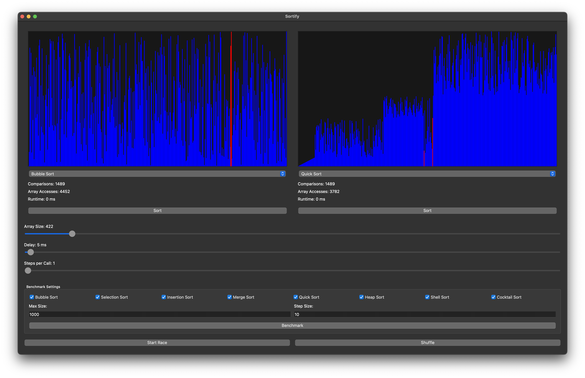

# Sortify - Sorting Algorithm Visualizer



**Sortify** is an interactive PyQt-based application for visualizing popular sorting algorithms. It allows users to compare the performance of various sorting algorithms in real-time while providing stats like comparisons, array accesses, and runtime.

## Features

- Real-time visualization of sorting algorithms:
  - Bubble Sort
  - Selection Sort
  - Insertion Sort
  - Merge Sort
  - Quick Sort
  - Heap Sort
  - Shell Sort
  - Cocktail Sort
- Adjustable array size, delay between steps, and steps per call for custom control over visualizations
- Dual sorting visualizers for direct algorithm comparison
- Benchmarking mode to compare algorithm runtimes
- Smooth animations and color-coded comparisons and swaps

## Installation

### Precompiled Executables

You can download precompiled executables for **macOS**, **Ubuntu**, **Windows**, and **RedHat** from the [Releases](https://github.com/Sortify/releases) page.

1. **Download** the appropriate zip file for your operating system:
   - macOS
   - Ubuntu
   - Windows
   - RedHat

2. **Extract the zip file**:
   - On macOS and Linux:

     ```bash
     unzip Sortify-<os>.zip
     cd Sortify
     ```

   - On Windows:
     - Right-click the zip file and choose "Extract All".
     - Open the extracted folder.

3. **Run the executable**:
   - On macOS and Ubuntu:

     ```bash
     ./Sortify
     ```

   - On Windows:
     - Double-click `Sortify.exe`.
   - On RedHat:
     After unzipping, you need to make the file executable:

     ```bash
     chmod +x Sortify
     ./Sortify
     ```

### From Source

If you prefer to run the app from the source code, follow these steps:

1. **Clone the repository**:

   ```bash
   git clone https://github.com/zehdari/Sortify
   cd sortify
   ```

2. **Set up a virtual environment**:
   Ensure you are using Python 3. Create and activate a virtual environment:

   ```bash
   python3 -m venv venv
   source venv/bin/activate  # On Windows: venv\Scripts\activate
   ```

3. **Install dependencies**:
   Install the required dependencies from the `requirements.txt` file:

   ```bash
   pip install -r requirements.txt
   ```

4. **Run the application**:

   ```bash
   python sortify.py
   ```

## Usage

- **Sorting Visualization**:
  - Choose a sorting algorithm from the dropdown menu (e.g., Bubble Sort, Quick Sort).
  - Adjust the array size and delay using the sliders.
  - Click "Sort" to begin the visualization.
  - Watch as the array elements are color-coded to show comparisons, swaps, and the final sorted array.
  
- **Comparing Algorithms**:
  - Use the dual visualizers to compare two different algorithms side-by-side.
  - Click "Start Race" to run both algorithms on the same shuffled array simultaneously.
  
- **Benchmark Mode**:
  - Select the algorithms you want to benchmark from the checkboxes.
  - Specify the maximum array size and step size for the benchmark.
  - Click "Benchmark" to plot the runtimes of the selected algorithms on a graph.

## Controls

- **Algorithm Selection**: Choose from the supported sorting algorithms in the dropdown.
- **Array Size**: Adjust the size of the array being sorted.
- **Delay**: Set the delay between steps in milliseconds for smoother or faster visualization.
- **Steps per Call**: Increase or decrease the number of steps processed per visualization frame for faster or more granular control.
- **Shuffle**: Randomize the array.
- **Start Race**: Run the selected algorithms side-by-side.
- **Benchmark**: Benchmark selected algorithms over different array sizes and visualize the runtime graph.

## File Structure

- **`sortify.py`**: Main file containing the Sortify UI and logic for visualizing and controlling the sorting process.
- **`sortAlgorithms.py`**: Contains the implementations of all sorting algorithms used in Sortify.
- **`resources/`**: Folder containing icons and other static resources for the application.
- **`requirements.txt`**: Python dependencies required to run Sortify from the source.
